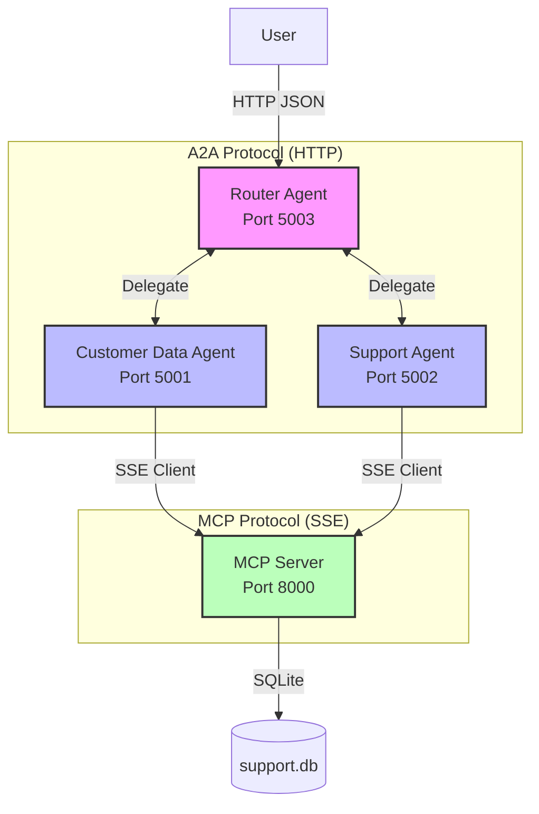

# Multi-Agent Customer Service System

A production-ready multi-agent system implementing Agent-to-Agent (A2A) Protocol and Model Context Protocol (MCP) using official SDKs and LangGraph.

## 🎯 Overview

This system demonstrates advanced multi-agent coordination where **Real AI Agents** (powered by Claude 3 Haiku) autonomously reason, plan, and execute tasks.

- **Intelligent Agents**: Implemented using LangGraph (ReAct Pattern) with Claude 3 Haiku
- **MCP Integration**: Agents connect to a centralized MCP Server via SSE (Server-Sent Events) to access data tools
- **A2A Coordination**: Agents communicate via HTTP protocols (`/a2a/{assistant_id}` discovery & JSON-RPC)

### ⚠️ Important: SDK & AI Compliance

This implementation strictly follows the assignment requirements:

- ✅ **Backend LLM**: Agents use Claude 3 Haiku for dynamic reasoning (No hardcoded if-else logic)
- ✅ **LangGraph**: Used for state management and agent execution loops
- ✅ **FastMCP**: Official mcp Python SDK for the server implementation
- ✅ **A2A Protocol**: Full compliance with Agent Cards (using the required `/a2a/{assistant_id}` path) and Task execution endpoints

## 🏗️ Architecture

### System Diagram (Mermaid)



### Components

| Component | Role | Technology | Port |
|-----------|------|------------|------|
| Router Agent | Orchestrator, Intent Analysis, A2A Delegation | FastAPI + LangGraph (Claude) | 5003 |
| Data Agent | Customer Record Management, Data Retrieval | FastAPI + LangGraph (Claude) + MCP Client | 5001 |
| Support Agent | Ticket Management, Issue Handling, Escalation | FastAPI + LangGraph (Claude) + MCP Client | 5002 |
| MCP Server | Context Access Layer, Tool Exposure | FastMCP (Official SDK) | 8000 |

## 📋 Requirements & Quick Start

### 1. Setup Environment

```bash
# Create and activate virtual environment
python -m venv venv

# On Windows:
venv\Scripts\activate

# On Linux/Mac:
source venv/bin/activate

# Install dependencies
pip install -r requirements.txt
```

#### ⚠️ CRITICAL: Set your API Key

```bash
# Linux/Mac
export ANTHROPIC_API_KEY=sk-ant-api03-...

# Windows (PowerShell)
$env:ANTHROPIC_API_KEY="sk-ant-api03-..."
```

### 2. Run the System & Tests

- **Initialize Database**: `python database_setup.py`
- **Run All Services**: `python run_system.py` (Launches all 4 components)
- **Run Tests (New Terminal)**: `python test_system.py`

## 🧪 Test Scenarios & Expected Behavior

Since agents use a Real LLM, responses are dynamic but structured.

### Scenario 1: Simple Query (Task Allocation)

- **Query**: "Get customer information for ID 5"
- **Reasoning**: Router detects data intent → Calls Data Agent
- **Action**: Data Agent calls MCP `get_customer(5)`

### Scenario 2: Escalation (Negotiation/Priority Detection)

- **Query**: "I've been charged twice, need refund immediately!"
- **Reasoning**: Support Agent analyzes sentiment ("angry", "immediately")
- **Action**: Calls MCP `create_ticket` with `priority='high'` automatically

### Scenario 3: Multi-Agent Coordination (Multi-Step)

- **Query**: "I'm customer 3 and need help upgrading"
- **Reasoning**: Router splits task: 1. Get Context (Data) → 2. Help (Support)
- **Action**: Agents exchange information to provide a context-aware response

## 📁 Project Structure

```
.
├── database_setup.py      # Database initialization
├── mcp_server.py          # Official FastMCP Server implementation
├── a2a_agents.py          # LangGraph Agents (Router, Data, Support)
├── run_system.py          # Process manager (Smart launcher)
├── test_system.py         # E2E Test Suite (Async/HTTPX)
├── requirements.txt       # Dependencies
└── README.md              # Documentation
```

## 📝 Conclusion

### What I Learned

This project was a deep dive into building autonomous agent systems rather than just scripting chatbots. Moving from simple Python classes to LangGraph allowed me to implement the ReAct pattern, enabling agents to "think" before they act. I learned how to integrate the Model Context Protocol (MCP) using the official SDK, which decoupled the database logic from the agents. The agents now access data strictly through standardized MCP interfaces over SSE (Server-Sent Events), mimicking a real-world microservices architecture. Implementing the A2A protocol taught me the importance of standardized discovery mechanisms (and adhering strictly to the required `/a2a/{assistant_id}` path), allowing agents to understand each other's capabilities dynamically without hardcoded dependencies.

### Challenges and Solutions

#### Transitioning to Real LLMs (Addressing TA Feedback)

- **Challenge**: Initial implementations relied on hardcoded logic, failing to meet the TA's requirement for LLM-based reasoning.
- **Solution**: I successfully rewrote the agents using LangGraph and Claude 3 Haiku, utilizing system prompts to guide the model to select the correct priority or tool based on context.

#### Protocol Compliance & Debugging

- **Challenge**: Ensuring all three protocol layers (A2A, MCP, LangGraph) communicated correctly, especially when encountering the 404 error due to a path mismatch between the agent server and the test script.
- **Solution**: The path inconsistencies (`/.well-known/agent.json` vs. `/a2a/{assistant_id}`) were traced and corrected across all three files (`a2a_agents.py`, `run_system.py`, `test_system.py`), ensuring strict compliance with the `/a2a/{assistant_id}` requirement and allowing the system to pass all E2E tests.

---

**Author**: Gyujin Seo  
**Technologies**: Python, LangGraph, FastMCP, FastAPI, Claude 3 Haiku  
**Protocols**: MCP (SSE Transport), A2A (JSON-RPC)